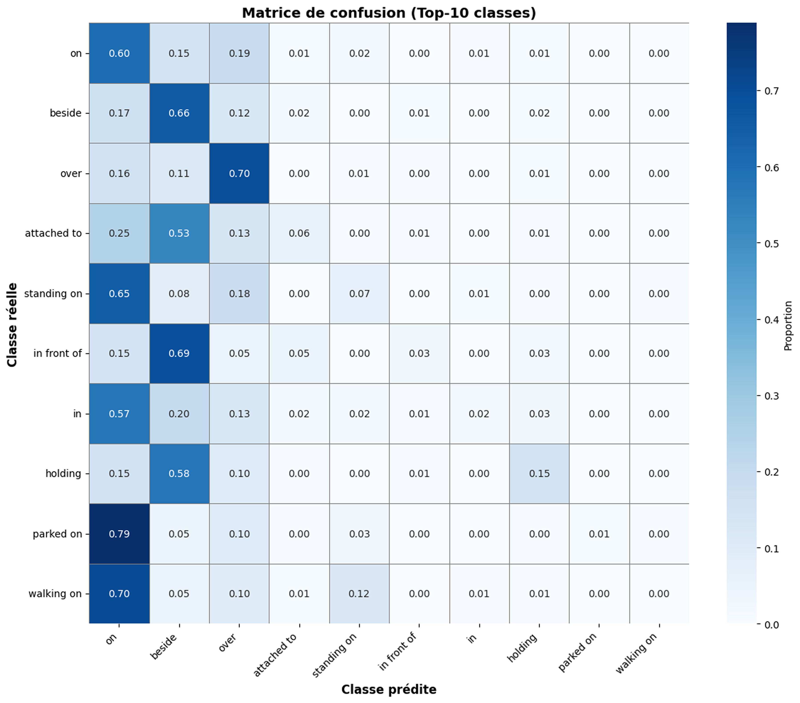
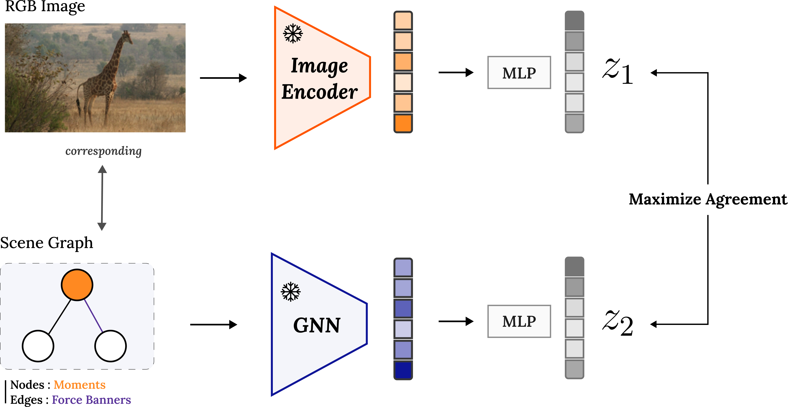

# Graph Contrastive Learning for Spatial Relations

## Présentation du projet

Ce projet a été réalisé dans le cadre de l’UE **Modélisation de Systèmes Intelligents** du **Master 2 Informatique - Parcours Vision et Machine Intelligente (VMI)** à **l’Université Paris Cité**.

L’objectif principal est de modéliser et d’apprendre la **spatialité des scènes visuelles**, c’est-à-dire l’organisation relative des objets dans une image, **indépendamment de leur apparence visuelle**.
Pour cela, les scènes sont représentées sous la forme de **graphes de scène**, permettant une description explicite et structurée des relations spatiales entre objets.

Chaque scène est modélisée comme un graphe :

* les **noeuds** représentent les objets,
* les **arêtes** représentent les relations spatiales entre objets.

Nous adoptons une approche **auto-supervisée** basée sur l’**apprentissage contrastif sur graphes (Graph Contrastive Learning, GraphCL)**.
([You et al., 2020](https://arxiv.org/pdf/2010.13902))

**Encadrants :** Camille Kurtz, Laurent Wendling, Logan Servant
---

## Données utilisées

Le projet repose sur le dataset **Panoptic Scene Graph (PSG)** ([Yang et al., 2022](https://github.com/Jingkang50/OpenPSG)), qui fournit :

* des images naturelles issues de COCO,
* des masques de segmentation panoptiques,
* des graphes de scène associés à chaque image.

### Points forts du dataset

* représentation explicite de la structure des scènes,
* cohérence géométrique entre objets et relations,
* cadre réaliste pour l’étude de la spatialité des scènes naturelles.

### Limites du dataset

* fort déséquilibre des annotations de relations,
* nombreuses relations de type **action** ou **sémantique** (*holding*, *wearing*, etc.),
* désalignement partiel entre la nature **spatiale** des descripteurs et les labels disponibles.

Ces limitations influencent fortement les choix méthodologiques et les stratégies d’évaluation.

---

## Représentation des scènes

Chaque image est transformée en un **graphe de scène** combinant des descripteurs.

### Noeuds

* Les noeuds correspondent aux objets de la scène.
* Chaque objet est décrit à l’aide des **moments de Hu**, permettant de capturer des informations de forme invariantes à l’échelle et à la rotation.

### Arêtes

* Les arêtes correspondent aux relations spatiales entre paires d’objets.
* Elles sont décrites à l’aide de **bandeaux de force** (Relative Position Descriptors, RPD), ([Deléarde et al., 2021](https://u-paris.hal.science/hal-03409527/document)) qui encodent des **relations directionnelles et spatiales continues**.

Cette représentation permet de séparer explicitement :

* les propriétés intrinsèques des objets,
* les informations relationnelles et géométriques.

---

## Méthodologie

### Apprentissage contrastif sur graphes

La stratégie d’apprentissage est inspirée de **SimCLR**, adaptée aux graphes de scène :

* deux vues augmentées d’un même graphe sont générées,
* les augmentations sont appliquées principalement aux **attributs d’arêtes** (bruit, décalage angulaire, lissage), afin de rester cohérentes avec la nature spatiale des descripteurs,
* un **Graph Neural Network (GNN)** encode les graphes et produit des représentations latentes,
* une fonction de perte contrastive rapproche les embeddings issus d’un même graphe et éloigne ceux provenant de graphes différents.

Les représentations apprises peuvent être exploitées :

* au **niveau des relations** (embeddings d’arêtes),
* au **niveau global du graphe** (pooling).

  

  <em>
  Architecture de l’apprentissage contrastif.
  </em>

---

## Architecture du modèle (GNN)

L’encodeur de graphes utilisé dans ce projet est un GNN basé sur **GIN** (Graph Isomorphism Network), implémenté avec **3 couches `GINConv`** et des connexions résiduelles. L’architecture est conçue pour produire des **embeddings d’arêtes** adaptés à l’apprentissage contrastif, et un **embedding global de graphe** pour des analyses et tâches aval (retrieval, visualisation).

### Entrées

* **Attributs de nœuds** : vecteurs de moments statistiques (moments de Hu) projetés dans un espace latent de dimension `hidden_dim` via un MLP :

  * `Linear(node_dim -> hidden_dim) + LayerNorm + ReLU + Dropout`
* **Attributs d’arêtes** : bandeaux de force (FB) encodés par un MLP dédié (`content_enc`) :

  * `Linear(edge_dim -> 2*hidden_dim) + LayerNorm + ReLU + Dropout`
  * puis `Linear(2*hidden_dim -> hidden_dim) + LayerNorm + ReLU`

### Propagation sur les nœuds

Trois couches successives sont appliquées :

* `GINConv` + connexion résiduelle + `LayerNorm` + `ReLU`
* répétées 3 fois, produisant des représentations de nœuds de plus en plus contextuelles (`h1`, `h2`, `h3`)

Cette étape permet d’agréger l’information locale et de contextualiser les objets en fonction de leur voisinage dans le graphe.

### Construction des embeddings d’arêtes

Pour chaque arête (u -> v), une représentation d’arête est construite en concaténant :

* l’embedding du noeud source `h3[u]`,
* l’embedding du noeud cible `h3[v]`,
* l’embedding de contenu de l’arête `c(e)` issu de `content_enc`.

On obtient ainsi un vecteur de taille `3*hidden_dim`, transformé par un MLP de fusion (`fuse_mlp`) pour produire un **embedding d’arête** `h_e` de dimension `hidden_dim`.

### Projection head (apprentissage contrastif)

Comme dans SimCLR, l’embedding d’arête `h_e` est projeté dans un espace contrastif `z_e` via un **projection head** :

* `Linear(hidden_dim -> hidden_dim) + ReLU + Linear(hidden_dim -> proj_dim)`

La **perte contrastive InfoNCE** est calculée sur ces vecteurs `z_e`, tandis que les tâches aval utilisent `h_e` (sans projection).

### Embedding global de graphe (graph-level)

Un embedding global est construit en combinant :

* un pooling des noeuds (`global_mean_pool` sur `h3`),
* un pooling des arêtes (`global_mean_pool` sur `h_edges`).

Les deux représentations sont moyennées, passées dans un petit MLP de readout, puis normalisées (L2) pour être utilisées en retrieval et visualisation.

### Hyperparamètres principaux

* `hidden_dim = 256`
* `proj_dim = 128`
* `dropout = 0.1`
* Perte contrastive : **InfoNCE** avec `temperature = 0.1`

## Évaluation par prédiction de relations

Une première évaluation est menée via une tâche de **prédiction de relations** à l’aide d’un classifieur linéaire entraîné sur des embeddings figés (linear probing).

### Observations principales

* bonnes performances sur les relations spatiales fréquentes (*on*, *over*, *beside*),
* performances faibles sur les relations rares ou sémantiques,
* forte dégradation liée au déséquilibre des classes.

#### Métriques globales (validation)

- Accuracy (micro-averaged) : **0.347**
- F1-score macro-averaged : **0.044**
- F1-score weighted-averaged : **0.264**

Ces résultats révèlent un **écart important entre les métriques macro et pondérées**, indiquant un **fort déséquilibre de classes** dans le dataset.

#### Analyse par fréquence de classes

| Fréquence des classes | Accuracy |
|-----------------------|----------|
| Très fréquentes (>1000) | 0.459 |
| Fréquentes (500–1000)   | 0.045 |
| Moyennes (100–500)      | 0.011 |
| Rares (10–100)          | 0.005 |
| Très rares (<10)        | 0.017 |

#### Analyse par classe

Les meilleures performances (F1-score) sont observées pour des relations **principalement directionnelles** :

- *over* (F1 = 0.538)
- *beside* (F1 = 0.453)
- *on* (F1 = 0.408)

À l’inverse, de nombreuses relations de type **action ou interaction sémantique** (*wearing*, *talking to*, *throwing*, etc.) ne sont jamais prédites.  
Au total, **35 classes sur 56** ne sont jamais produites par le modèle.

Les **matrices de confusion** montrent des confusions structurées entre relations géométriquement proches (par exemple *standing on* confondu avec *on*), ce qui est cohérent avec la nature directionnelle des bandeaux de force.

  

  <em>
  Matrice de confusion, Top-10 relations
  </em>

  

  <em>
  Exemples de prédiction de relations.
  </em>

### Limites de cette évaluation

* déséquilibre extrême des classes,
* annotations souvent peu adaptées à une modélisation purement spatiale,
* métriques quantitatives peu représentatives de l’objectif réel du projet.

Ainsi, la tâche de classification de relations apparaît **mal alignée avec la nature des représentations apprises**.

---

## Visualisation des embeddings (t-SNE)

Des visualisations par **t-SNE** sont réalisées afin d’analyser la structure de l’espace latent :

* après l’encodage par le GNN seul,
* après l’alignement multimodal image–graphe.

  

  <em>
  Visualisation t-SNE des embeddings extraits par l'apprentissage contrastif sur le GNN.
  </em>

  

  <em>
  Visualisation t-SNE des embeddings extraits par l'alignement multimodal.
  </em>

Les visualisations montrent :

* un regroupement progressif des scènes selon leur configuration spatiale,
* une meilleure structuration après apprentissage contrastif,
* un alignement plus cohérent après intégration de la modalité image.

---

## Alignement multimodal image RGB ↔ graphe de scène

Une extension naturelle du projet consiste à aligner les **images RGB** et les **embeddings de graphes de scène** dans un espace latent commun.

### Principe

* un encodeur image (CNN) produit des embeddings visuels,
* le GNN produit des embeddings spatiaux à partir des graphes,
* des têtes de projection alignent les deux modalités via une perte contrastive.

  

  <em>
  Architecture de l'alignement multimodal entre image RGB et représentation de graphe.
  </em>

### Intérêt

* le graphe agit comme une **supervision spatiale structurée**,
* l’espace latent est organisé selon des critères géométriques,
* l’inférence peut être réalisée à partir d’une **simple image RGB**,
* la tâche de retrieval ne nécessite aucun label relationnel.

---

## Évaluation par retrieval (approche privilégiée)

Une évaluation qualitative par **retrieval** est proposée, plus alignée avec l’objectif de structuration de l’espace latent.

### Principe

* les embeddings appris sont utilisés pour rechercher des scènes spatialement similaires,
* comparaison avec une baseline purement visuelle basée sur un **encodeur ResNet pré-entraîné**.

### Résultats qualitatifs

  

  <em>
  Exemples retrieval avec ResNet seul.
  </em>

  

  <em>
  Exemples retrieval avec modèle aligné.
  </em>

* la baseline CNN privilégie des similarités d’apparence globale,
* l’approche proposée favorise une **cohérence spatiale entre objets**,
* les scènes retournées présentent des configurations spatiales similaires, même lorsque l’apparence visuelle diffère.

Cette tâche ne nécessite pas de labels relationnels explicites et constitue une évaluation plus fidèle de la qualité des représentations spatiales.

  

  <em>
  Comparaison d'un retrieval avec la même query : ResNet seul vs Modèle aligné
  </em>

## Limites et critiques

La limite principale du projet réside dans le dataset **PSG** :

* bien que riche et structuré, il contient majoritairement des relations d’action,
* les bandeaux de force capturent des relations directionnelles, mais **prédire une action à partir d’un descripteur spatial n’a pas de sens**.

L’évaluation quantitative reste également difficile :

* la prédiction de relations est pénalisée par le déséquilibre,
* le retrieval nécessite de définir une notion de similarité entre graphes complexes.

Les baselines visuelles (CNN) capturent principalement des **corrélations statistiques** et des signatures visuelles, donnant parfois une cohérence spatiale apparente sans réelle compréhension de la spatialité.

---

## Conclusion et perspectives

Les résultats qualitatifs suggèrent que :

* la spatialité des scènes est correctement capturée,
* l’apprentissage contrastif sur graphes est une **stratégie pertinente et prometteuse** pour la modélisation des relations spatiales.

Une perspective majeure serait l’utilisation d’un dataset combinant :

* des relations spatiales directionnelles explicites (type Visual Genome),
* des masques panoptiques,
* des graphes de scène cohérents.

Un tel dataset permettrait probablement d’obtenir de meilleurs résultats quantitatifs et constitue une piste de recherche importante pour la suite.

<em> De manière plus générale, ce travail m’a conduit à considérer que les modèles neuronaux destinés à la compréhension de scènes visuelles doivent nécessairement intégrer une prise en compte explicite de la spatialité. Si les mécanismes d’attention et les architectures convolutionnelles ont permis des avancées majeures, ces mécanismes restent souvent limités à une modélisation implicite des relations spatiales, fondée sur des corrélations visuelles. Une compréhension plus fine de la spatialité semble nécessiter l’intégration de modules de raisonnement spatial dédiés, capables de manipuler des relations géométriques et directionnelles explicites, par exemple à partir de descripteurs de positions relatives. L’enjeu n’est pas d’opposer sémantique visuelle et raisonnement spatial, mais de les combiner de manière complémentaire afin de construire des représentations plus robustes et plus interprétables des scènes visuelles. <em>